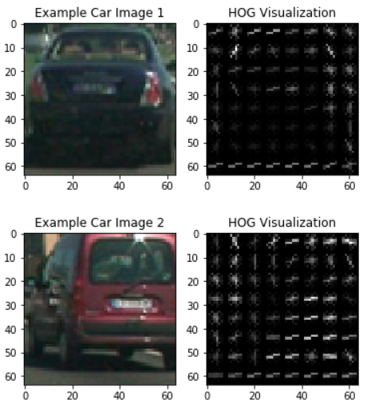
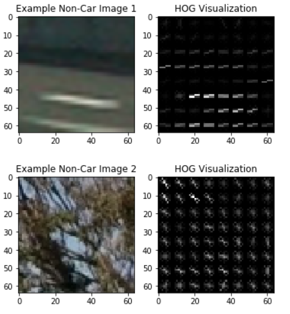
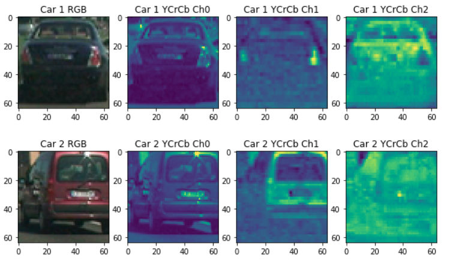
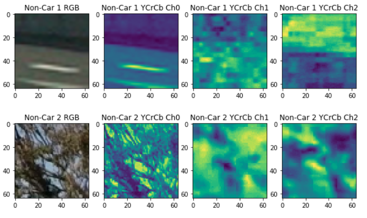

# Vehicle Detection
[](http://www.udacity.com/drive)


In this project, my goal is to write a software pipeline to detect vehicles in a video. The steps are the following:

* Perform a Histogram of Oriented Gradients (HOG) feature extraction on a labeled training set of images and train a classifier Linear SVM classifier
* Apply a color transform and append binned color features, as well as histograms of color, to the HOG feature vector. 
* Normalize your features and randomize a selection for training and testing.
* Implement a sliding-window technique and use the trained classifier to search for vehicles in images.
* Run pipeline on a video stream and create a heat map of recurring detections frame by frame to reject outliers and follow detected vehicles.
* Estimate a bounding box for vehicles detected.

The code for these steps can be found in the [Jupyter notebook](https://github.com/zhoujh30/CarND-Vehicle-Detection-P5/blob/master/Vehicle_Detection.ipynb).  

Here are links to the labeled data for [vehicle](https://s3.amazonaws.com/udacity-sdc/Vehicle_Tracking/vehicles.zip) and [non-vehicle](https://s3.amazonaws.com/udacity-sdc/Vehicle_Tracking/non-vehicles.zip) examples used to train the classifier.  These example images come from a combination of the [GTI vehicle image database](http://www.gti.ssr.upm.es/data/Vehicle_database.html), the [KITTI vision benchmark suite](http://www.cvlibs.net/datasets/kitti/), and examples extracted from the project video itself.


### Histogram of Oriented Gradients (HOG)

#### 1.  Extract HOG features from the training images.

The code for this step is contained in the 2nd code cell of the [Jupyter notebook](https://github.com/zhoujh30/CarND-Vehicle-Detection-P5/blob/master/Vehicle_Detection.ipynb).  

I started by reading in all the `vehicle` and `non-vehicle` images. I then explored different color spaces and different `skimage.hog()` parameters (`orientations`, `pixels_per_cell`, and `cells_per_block`). I grabbed random images from each of the two classes and displayed original images and `skimage.hog()` output here:

|Car|Non-Car|
|-------------|-------------|
|||

Here is an example using the `YCrCb` color space and HOG parameters of `orientations=9`, `pixels_per_cell=(8, 8)` and `cells_per_block=(2, 2)`:

<p align="center">
  
  
</p>

#### 2. Choose appropriate HOG parameters.

I tried various combinations of parameters and settled on this choice of HOG parameters since this returns the best result:

```
color_space = 'YCrCb'
spatial_size = (32, 32)
hist_bins = 32
orient = 9
pix_per_cell = 8
cell_per_block = 2
hog_channel = 'ALL'
spatial_feat = True
hist_feat = True
hog_feat = True
```

#### 3. Train a classifier using your selected HOG features.

The code for this step can be found in 12th and 13th cell of the [Jupyter notebook](https://github.com/zhoujh30/CarND-Vehicle-Detection-P5/blob/master/Vehicle_Detection.ipynb).  

I trained a linear SVM using [`sklearn LinearSVC`](http://scikit-learn.org/stable/modules/generated/sklearn.svm.LinearSVC.html) with default setting of `square-hinge` loss function and `l2` penalty. 

I used Amazon Web Services to launch an EC2 GPU instance (g2.2xlarge) to train the model. 


### Sliding Window Search

#### 1.  Implement a sliding window search. How did you decide what scales to search and how much to overlap windows?

The code for this step can be found in 12th and 13th cell of the [Jupyter notebook](https://github.com/zhoujh30/CarND-Vehicle-Detection-P5/blob/master/Vehicle_Detection.ipynb).


![alt text][image3]

#### 2. Show some examples of test images to demonstrate how your pipeline is working.  What did you do to optimize the performance of your classifier?

Ultimately I searched on two scales using YCrCb 3-channel HOG features plus spatially binned color and histograms of color in the feature vector, which provided a nice result.  Here are some example images:

![alt text][image4]
---

### Video Implementation

#### 1. Provide a link to your final video output.  Your pipeline should perform reasonably well on the entire project video (somewhat wobbly or unstable bounding boxes are ok as long as you are identifying the vehicles most of the time with minimal false positives.)
Here's a [link to my video result](./project_video.mp4)


#### 2. Describe how (and identify where in your code) you implemented some kind of filter for false positives and some method for combining overlapping bounding boxes.

I recorded the positions of positive detections in each frame of the video.  From the positive detections I created a heatmap and then thresholded that map to identify vehicle positions.  I then used `scipy.ndimage.measurements.label()` to identify individual blobs in the heatmap.  I then assumed each blob corresponded to a vehicle.  I constructed bounding boxes to cover the area of each blob detected.  

Here's an example result showing the heatmap from a series of frames of video, the result of `scipy.ndimage.measurements.label()` and the bounding boxes then overlaid on the last frame of video:

### Here are six frames and their corresponding heatmaps:

![alt text][image5]

### Here is the output of `scipy.ndimage.measurements.label()` on the integrated heatmap from all six frames:
![alt text][image6]

### Here the resulting bounding boxes are drawn onto the last frame in the series:
![alt text][image7]


---

### Discussion

#### 1. Briefly discuss any problems / issues you faced in your implementation of this project.  Where will your pipeline likely fail?  What could you do to make it more robust?

Here I'll talk about the approach I took, what techniques I used, what worked and why, where the pipeline might fail and how I might improve it if I were going to pursue this project further.  
