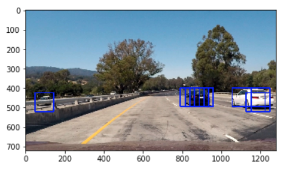
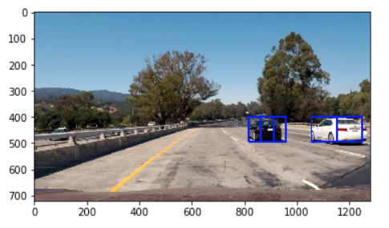
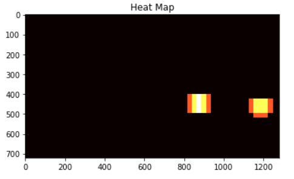
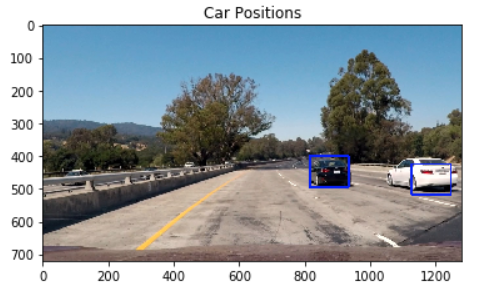
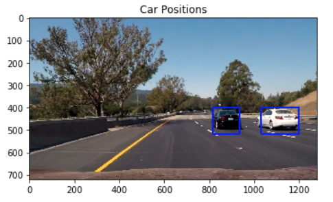

# Vehicle Detection
[](http://www.udacity.com/drive)


In this project, my goal is to write a software pipeline to detect vehicles in a video. The steps are the following:

* Perform a Histogram of Oriented Gradients (HOG) feature extraction on a labeled training set of images and train a classifier Linear SVM classifier
* Apply a color transform and append binned color features, as well as histograms of color, to the HOG feature vector. 
* Normalize your features and randomize a selection for training and testing.
* Implement a sliding-window technique and use the trained classifier to search for vehicles in images.
* Run pipeline on a video stream and create a heat map of recurring detections frame by frame to reject outliers and follow detected vehicles.
* Estimate a bounding box for vehicles detected.

The code for these steps can be found in the [Jupyter notebook](https://github.com/zhoujh30/CarND-Vehicle-Detection-P5/blob/master/Vehicle_Detection.ipynb).  

Here are links to the labeled data for [vehicle](https://s3.amazonaws.com/udacity-sdc/Vehicle_Tracking/vehicles.zip) and [non-vehicle](https://s3.amazonaws.com/udacity-sdc/Vehicle_Tracking/non-vehicles.zip) examples used to train the classifier.  These example images come from a combination of the [GTI vehicle image database](http://www.gti.ssr.upm.es/data/Vehicle_database.html), the [KITTI vision benchmark suite](http://www.cvlibs.net/datasets/kitti/), and examples extracted from the project video itself.


### Histogram of Oriented Gradients (HOG)

#### 1.  Extract HOG features from the training images.

The code for this step is contained in the 2nd code cell of the [Jupyter notebook](https://github.com/zhoujh30/CarND-Vehicle-Detection-P5/blob/master/Vehicle_Detection.ipynb).  

I started by reading in all the `vehicle` and `non-vehicle` images. I then explored different color spaces and different `skimage.hog()` parameters (`orientations`, `pixels_per_cell`, and `cells_per_block`). I grabbed random images from each of the two classes and displayed original images and `skimage.hog()` output here:

|Car|Non-Car|
|-------------|-------------|
|||

Here is an example using the `YCrCb` color space and HOG parameters of `orientations=9`, `pixels_per_cell=(8, 8)` and `cells_per_block=(2, 2)`:

|Car|Non-Car|
|-------------|-------------|
|||


#### 2. Choose appropriate HOG parameters.

I tried various combinations of parameters and settled on this choice of HOG parameters since this returns the best result:

```
color_space = 'YCrCb'
spatial_size = (32, 32)
hist_bins = 32
orient = 9
pix_per_cell = 8
cell_per_block = 2
hog_channel = 'ALL'
spatial_feat = True
hist_feat = True
hog_feat = True
```

#### 3. Train a classifier using your selected HOG features.

The code for this step can be found in 12th and 13th cell of the [Jupyter notebook](https://github.com/zhoujh30/CarND-Vehicle-Detection-P5/blob/master/Vehicle_Detection.ipynb). I trained a linear SVM using [`sklearn.svm.LinearSVC`](http://scikit-learn.org/stable/modules/generated/sklearn.svm.LinearSVC.html) with default setting of `square-hinge` loss function and `l2` penalty. 

I used Amazon Web Services to launch an EC2 GPU instance (g2.2xlarge) to train the model. 


### Sliding Window Search

#### 1.  Implement a sliding window search. 

The code for this step can be found in 21st cell of the [Jupyter notebook](https://github.com/zhoujh30/CarND-Vehicle-Detection-P5/blob/master/Vehicle_Detection.ipynb). The function `find_cars()` is used to extract hog features once and then can be sub-sampled to get all of its overlaying windows. 

`window = 64`, `pix_per_cell = 8` and `cell_per_block` define that 64 is the orginal sampling rate, with 8 cells and 8 pix per cell. `cells_per_step = 2` defines that the window step 2 cells each time. `scale = 1.5` defines the search scale and was initially used. This returns images with detected vehicles but there are multiple detections on same vihicle. Here is an example:

<p align="center">
  
</p>

To combine overlapping detections and remove false positives, I added "heat" (+=1) for all pixels within windows where a positive detection is reported by the classifier:

|Image with multiple detections|Heat-map|
|-------------|-------------|
|||


#### 2. Optimize the performance of the classifier

The code for this step can be found in 21st cell of the [Jupyter notebook](https://github.com/zhoujh30/CarND-Vehicle-Detection-P5/blob/master/Vehicle_Detection.ipynb). The function `detect_vehicles()` is used to process the images in pipeline. 

Later in the output video, using initial `scale = 1.5` there are still some false positives showing up or vehicles not detected and bounding boxes are not stable. Ultimately I searched on three scales (`scale = 1`, `scale = 1.5`, and`scale = 2.5`) instead using YCrCb 3-channel HOG features plus spatially binned color and histograms of color in the feature vector, which provided a nice result. Here are some examples:

|Example Image 1|Example Image 2|
|-------------|-------------|
|||


---

### Video Implementation

In the final video output, I applied the pipeline on video output from Project 4. Here's a [link to my video output](https://youtu.be/weLDYfWpUZQ) and below is an overview:

<p align="center">
  
</p>


---

### Discussion

#### 1. Briefly discuss any problems / issues you faced in your implementation of this project.  Where will your pipeline likely fail?  What could you do to make it more robust?

1. Though with large improvement from the initial video output, the bounding box in the final output is still not stable enough. One approach to improve the detection performance is to calculate the running average of the bounding box through the time.

2. Vehicle detection often failed when a vehicle was just entering the camera view (since the shape of vehicle is incomplete) or multiple vehicles overlapped each other. One way to improve this is to find more training data of these complicated scenarios and train the model again.

3. Additionally, it would be great to categorize different types of vehicles detected because it might be helpful to other analysis like path prediction. Finding more training data with types labeled would definitely help, but also adjust the search window based on certain types of vehicles, e.g. trucks are usually slower and may appear more often on the right part of the view.
